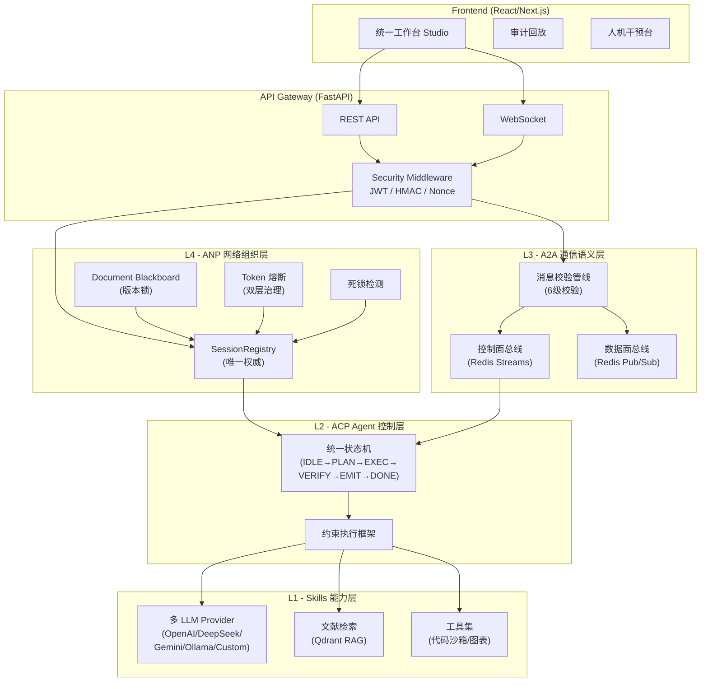
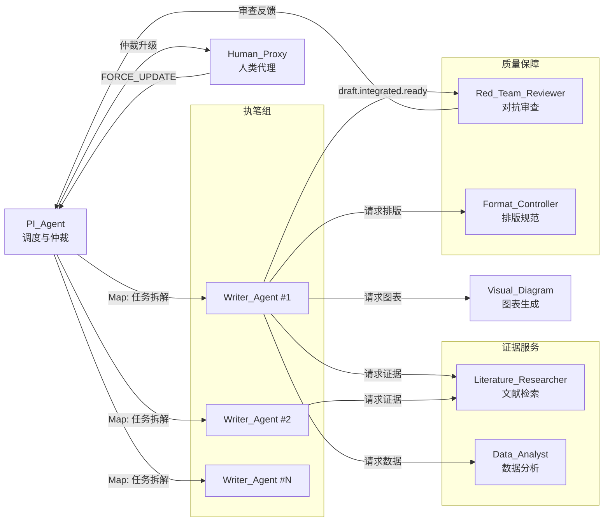
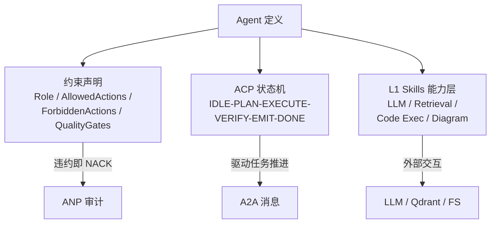
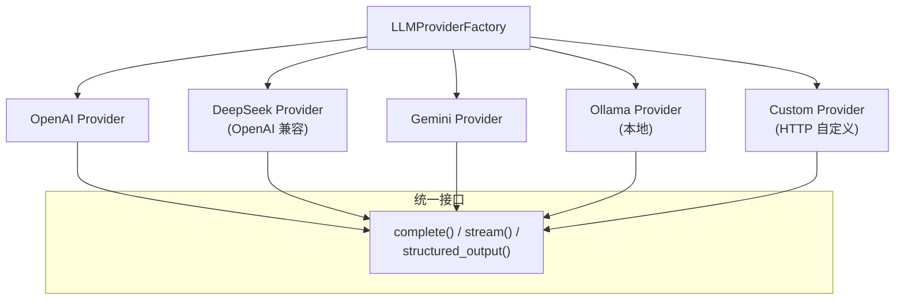
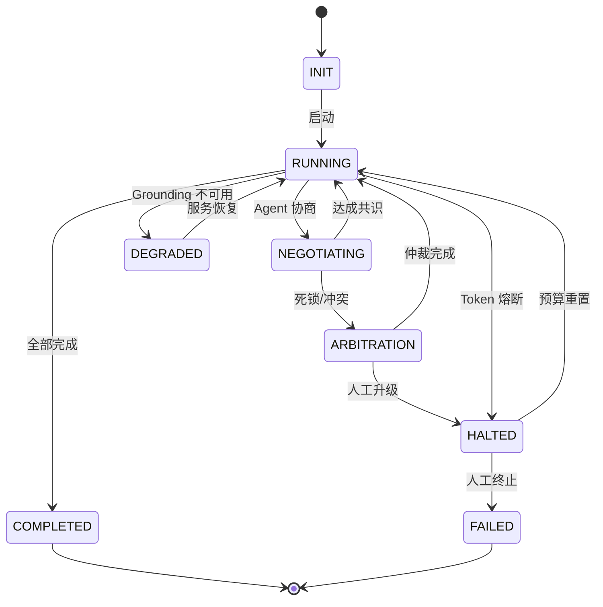
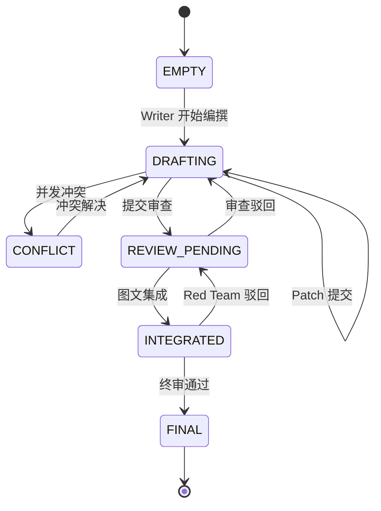
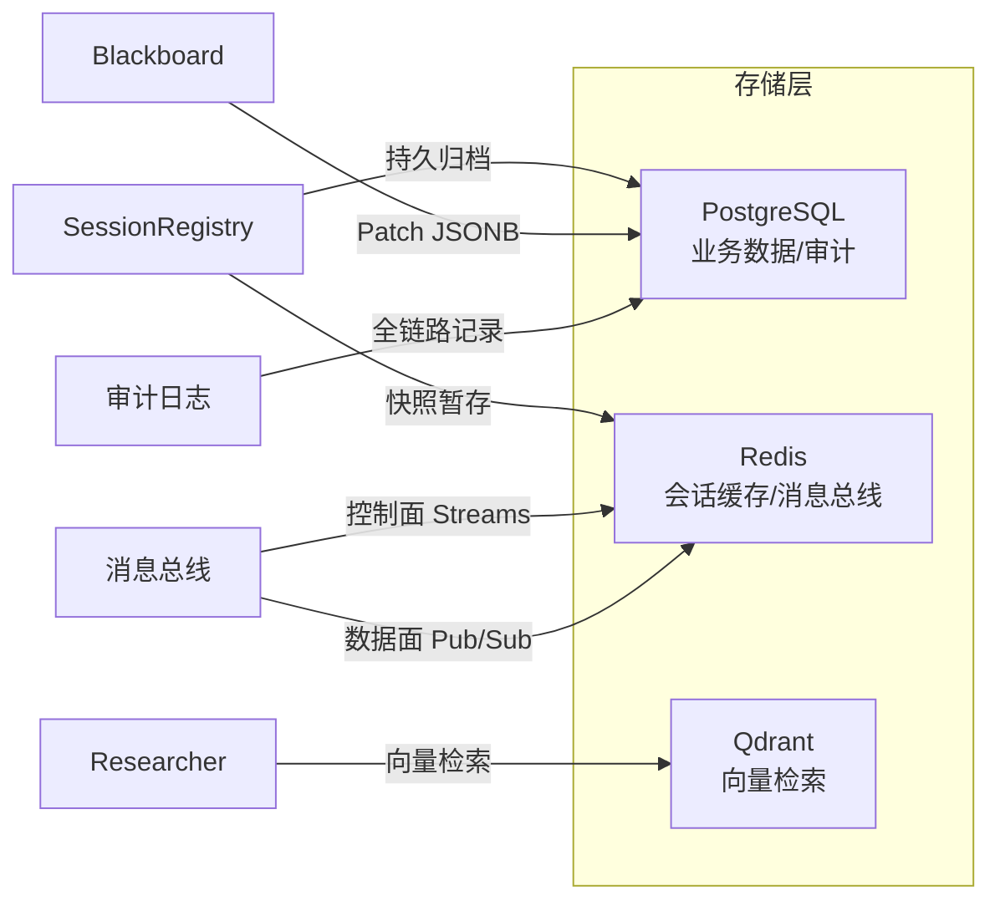

# PD-MAWS 系统架构文档

> 本文档随系统架构变化同步更新。最后更新时间：2026-03-02

## 一、系统总览

PD-MAWS（Protocol-Driven Multi-Agent Academic Writing System）是一个协议驱动的多智能体学术写作系统。
核心特征：可验证、可审计、可恢复，采用四层协议栈架构。

## 二、Agent 拓扑

系统包含 8 类 Agent 节点，通过 A2A 协议通信：

## 三、Agent 定义架构

每个 Agent 采用「约束声明 + ACP 状态机 + L1 Skills」三位一体模式：

## 四、多 LLM Provider 架构

## 五、会话状态机

## 六、文档 Blackboard 状态机

## 七、数据流

## 八、技术栈映射

| 层级 | 组件 | 技术选型 |
|------|------|----------|
| 前端 | 框架 | React 18 / Next.js (App Router) |
| 前端 | 编辑器 | Tiptap / ProseMirror |
| 前端 | Agent 流 | React Flow + Mermaid.js |
| 后端 | 主框架 | FastAPI (Python 3.11+) |
| 后端 | 编排 | LangGraph StateGraph |
| 后端 | 校验 | Pydantic v2 |
| 存储 | RDBMS | PostgreSQL 16+ |
| 存储 | 缓存 | Redis 7+ |
| 存储 | 向量 | Qdrant |
| 通信 | 控制面 | Redis Streams |
| 通信 | 数据面 | Redis Pub/Sub |
| 安全 | 认证 | JWT / OAuth2 |
| 安全 | 签名 | HMAC-SHA256 |
| 观测 | 链路 | OpenTelemetry |
